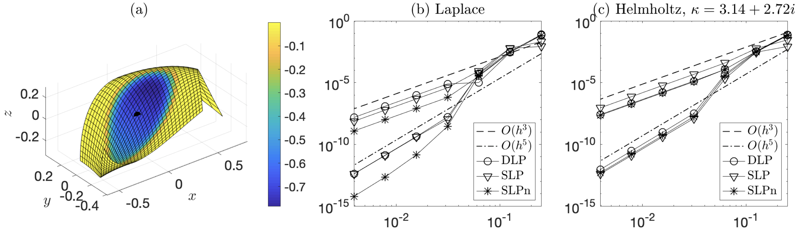

# ZetaTrap3D: High-order locally corrected trapezoidal rule for Laplace and Helmholtz layer potentials on surfaces in 3D

This is the MATLAB code accompanying the manuscript: 

* B. Wu and P.G. Martinsson, Corrected Trapezoidal Rules for Boundary Integral Equations in Three Dimensions (2020, [arXiv:2007.02512](https://arxiv.org/abs/2007.02512))

Let's consider a Laplace or Helmholtz layer potential from a smooth surface to a target location on the same surface, then the kernel is singular at the target location. Assume that the surface is parameterized over a rectangular domain and discretized uniformly using the double trapezoidal rule. Our corrected trapezoidal rule approximates this on-surface potential to high accuracy, provided that either the surface parameterization is doubly-periodic (such as a toroidal surface) or the potential is compactly supported on the surface.

Author: Bowei Wu, 2020/6/28

- Also contain supporting functions modified from Alex Barnett's [BIE3D](https://github.com/ahbarnett/BIE3D) package
- See also the related [ZetaTrap2D](https://github.com/bobbielf2/ZetaTrap2D) code for contour integrals.

### Note on MATLAB version

- If you are using a MATLAB version before R2017b, please rename the `Vecnorm.m` function to lower case `vecnorm.m` to use this code.
- In case you would like to feed a complex `s` into the Epstein zeta function `epstein_zeta(s,...)` or the custom upper incomplete gamma function `incgamma(s,x)` (which is not needed for the purpose of quadrature correction), the `igamma` function from the Symbolic Math Toolbox is required (which is slow).

### Example

ZetaTrap approximations of layer potentials on a surface patch with a smooth and compactly supported density function. Target is located at the center of the patch. Third-order and fifth-order convergence are observed in (b) for the Laplace potentials and (c) for the Helmholtz potentials. (This figure is extracted from the [manuscript](https://arxiv.org/abs/2007.02512).)

### Description of the main test files:

* `test_laplace3d_on_quartic_patch.m`, `test_helmholtz3d_on_quartic_patch.m` : evaluation of the Laplace, or Helmholtz, layer potentials compactly supported on a surface patch. These routines contain self convergence tests. (See Example 1 in the [manuscript](https://arxiv.org/abs/2007.02512).)
* `test_laplace3d_bie.m`, `test_helmholtz3d_bie.m` : solution of the Laplace, or Helmholtz, Dirichlet and Neumann problems exterior to a toroidal surface. These routines contain convergence tests. (See Example 2 in the [manuscript](https://arxiv.org/abs/2007.02512).)

Supporting functions:

* `epstein_zeta.m` : evaluation of the Epstein zeta function and its parametric derivatives.
* `incgamma.m` : custom fast implementation of the (scaled) upper incomplete gamma function that takes negative arguments
* `Lap3dLocCorr.m` : construct matrices associated with the Laplace layer potentials on a surface using locally corrected trapezoidal rule
* `Helm3dLocCorr.m` : construct matrices associated with the Helmholtz layer potentials on a surface using locally corrected trapezoidal rule
* `Lap3dSLPmat.m`, `Lap3dDLPmat.m` : construct matrices associated with Laplace layer potentials using native quadratures
* `Helm3dSLPmat.m`, `Helm3dDLPmat.m` : construct matrices associated with Helmholtz layer potentials using native quadratures
* `quadr_doubleptr.m`, `wobblytorus.m`, `showsurf.m` are (modified) functions from [BIE3D](https://github.com/ahbarnett/BIE3D)

